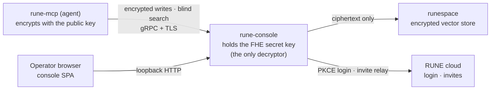
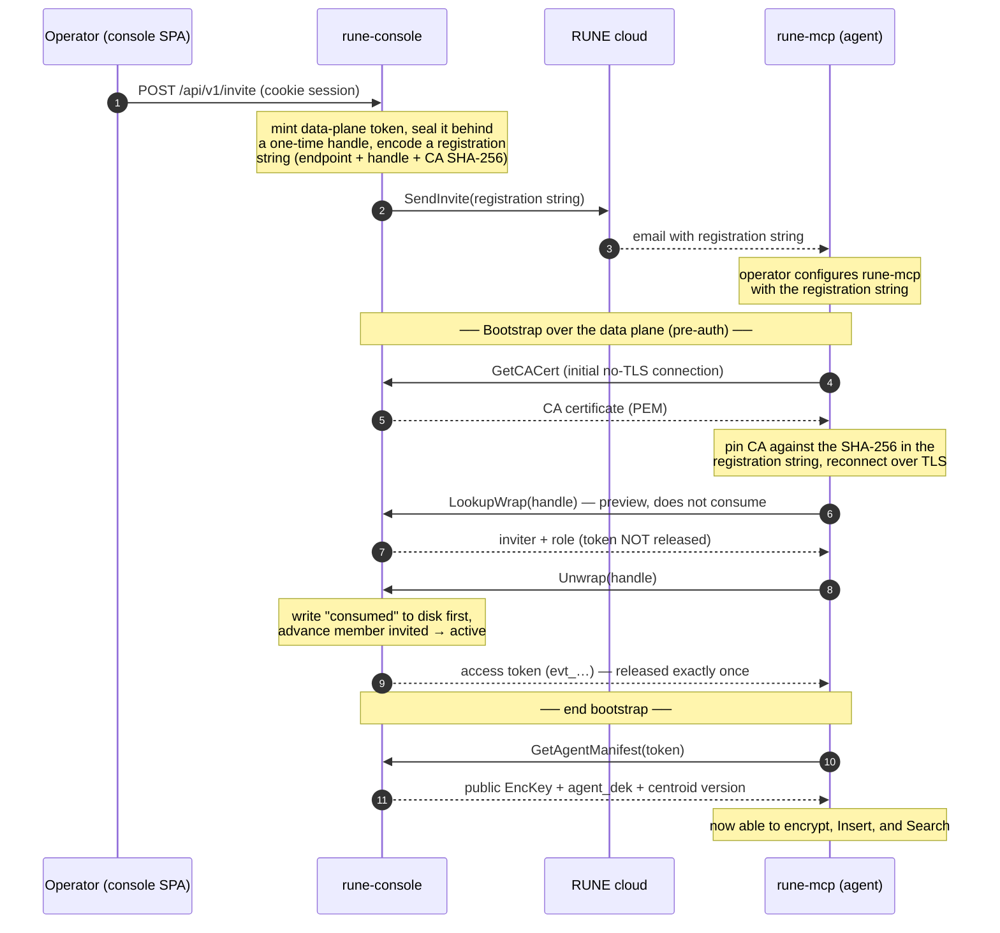

# Rune Console

**Rune Console** is the self-hosted control plane for [RUNE](https://rune.team).
Single `runeconsole` executable holds the Fully Homomorphic Encryption (FHE) secret key,
acts as the **sole client** to the `runespace` vector store, and serves a browser console
for operators to manage their team, member, and workspace.

[](LICENSE)

---

## What it does

Rune's three components cooperate to give AI agents a **private** organizational long-term memory:

| Component | Holds | Role |
|-----------|-------|------|
| **rune-console** (this repo) | the **secret** `SecKey`; derives each `agent_dek` from config's `team_secret` | The only holder of `SecKey`, so the only party that can decrypt. Deliver each agent's `EncKey` + `agent_dek`, proxies pre-encrypted insert and plaintext search query to `runespace`, decrypts and ranks the results, opens metadata, and administers identity/RBAC. |
| **rune-mcp** (agent side) | the **public** `EncKey`; the `agent_dek` fetched from the console | Encrypt each embedded vector (with public `EncKey`) and seal its metadata (symmetric `agent_dek`) locally, then deliver them to console |
| **runespace** (backend) | encrypted data | Store FHE-encrypted vectors + sealed metadata and computes encrypted similarity scores. |

### Network surfaces

The daemon exposes two network surfaces:

1. **gRPC data plane** - `0.0.0.0:50051`, **mandatory TLS**. This is what
   `rune-mcp` dials. The service cover (`rune.console.v1.ConsoleService`,
   [`proto/console_service.proto`](proto/console_service.proto))

2. **Console Backend** - `127.0.0.1:8787`, **loopback only**. HTTP backend for frontend.

### Architecture



Data flows one way through the trust boundary: `rune-mcp` encrypts on the
agent's machine with the *public* key, the console forwards ciphertext and is the
*only* holder of the secret key, and `runespace` stores and scores blobs it can
never read.

### Invite redemption

A new agent is admitted by an invite. The real access token stays sealed inside
the console behind a one-time **handle** — like a coat-check tag — and is released
exactly once, when `rune-mcp` redeems it. The token is never emailed; only the
handle (inside a registration string) travels.



Consumed state is persisted *before* the token is released: a crash can lose an
invite, but it can never double-release a token.

---

## Repository layout

```
rune-console/
├── cmd/                  # main.go — thin entrypoint (Cobra)
├── proto/                # console_service.proto (gRPC contract)
├── pkg/consolepb/        # generated Go protobuf/gRPC stubs (via buf)
├── internal/             # backend (Go)
│   ├── commands/         # CLI: root, daemon start, logs, version
│   ├── server/           # gRPC server, TLS, interceptors, admin + /api/v1 handlers, audit
│   ├── console/          # loopback BFF: PKCE auth, sessions, SPA embed, dataplane manager
│   ├── crypto/           # FHE key management + metadata sealing (wraps runespace-sdk)
│   ├── cloud/            # client for the RUNE cloud public API (invite relay)
│   ├── groups/           # group RBAC store + permission judge
│   ├── members/          # member registry
│   ├── invites/          # one-time invite "wrap" store
│   ├── tokens/           # access-token + role store
│   ├── db/ , storedb/    # SQLite store (hardened: 0600, per-commit fsync, integrity check)
│   └── tests/            # end-to-end tests (build tag: e2e)
├── frontend/             # console SPA (React 19 + Vite + TypeScript + Tailwind v4)
│   ├── src/              # api/ components/ pages/ hooks/ stores/ state/ ...
│   └── mock-server/      # standalone mock BFF for offline UI development
├── deployment/           # Terraform (aws/gcp/oci) + systemd/launchd units
├── install.sh            # one-shot installer (download → verify → service register)
├── .mise.toml            # task runner + tool versions (source of truth for dev)
└── buf.yaml / buf.gen.yaml
```

The production SPA build is emitted into `internal/console/webdist/` and
`go:embed`-ed into the binary, so a released `runeconsole` ships the console with
no separate web server.

---

## Prerequisites

Development is orchestrated by [**mise**](https://mise.jdx.dev), which pins every
tool version. Install mise, then:

```bash
mise install        # Go 1.26, buf, Node 22, pnpm
mise run setup      # go mod download, buf generate, install git hooks
mise run check      # verify: gofmt + go vet + go test -race ./...
```

That's the whole build/test toolchain — nothing else is installed by default.
The cloud-deploy tools (terraform, aws-cli, gcloud, oci) are opt-in, since
they're only needed to provision infrastructure:

```bash
MISE_ENV=deploy mise install   # only if you run the deployment/ Terraform
```

---

## Running it locally

There are three paths, fastest first.

### Path A — SPA against the mock backend (no Go, no TLS, no cloud)

The intended offline UI-development path. The mock server
(`frontend/mock-server/`) reimplements every BFF endpoint and boots already
logged in.

```bash
mise run fe:setup                             # pnpm install
(cd frontend && mise exec -- pnpm mock)       # mock BFF  → :4000
(cd frontend && mise exec -- pnpm dev:mock)   # Vite SPA  → :5173, proxies to the mock
```

Open <http://localhost:5173>.

### Path B — real daemon + live-reload SPA

Runs the actual Go backend. Requires a config file and self-signed certs
(both git-ignored, so you generate them once):

```bash
mise run certs                                # self-signed TLS certs
# write dev/runeconsole.conf using internal/server/testdata/runeconsole.conf.example
mise run dev                                  # go run ./cmd --config dev/runeconsole.conf daemon start
(cd frontend && mise exec -- pnpm dev)        # Vite SPA → :5173, proxies to :8787
```

> Login on this path hits the **real RUNE cloud** (`cloud.api_base_url`), so it
> needs a valid account. For pure offline UI work use Path A.

### Path C — prod-like install from the working tree

```bash
sudo bash scripts/install-dev.sh --target local   # builds, embeds the SPA, self-signed CA
```

Then open <http://127.0.0.1:8787>.

---

## Backend development (Go)

Everything runs through mise tasks (`mise tasks` lists them all):

| Task | What it does |
|------|--------------|
| `mise run check` | gofmt check + `go vet` + `go test -race ./...` (the CI gate) |
| `mise run go:build` | Build `bin/runeconsole` (builds + embeds the SPA first) |
| `mise run go:test:unit` | Unit tests only (E2E excluded by build tag) |
| `mise run go:test:e2e` | E2E tests against the built binary (run `go:build` first) |
| `mise run proto:go` | Regenerate gRPC stubs into `pkg/consolepb` from `proto/` |
| `mise run go:fmt` | `gofmt -w .` |

The FHE key handling and the `runespace` engine live in `internal/crypto` and are
built on `github.com/CryptoLabInc/runespace-sdk`. CGO is required
(`CGO_ENABLED=1`) — SQLite is `modernc.org/sqlite` but the SDK links native code.

**Editing the gRPC contract:** change `proto/console_service.proto`, run
`mise run proto:go`, and commit the regenerated stubs.

---

## Frontend development

React 19 + Vite 8 + TypeScript + Tailwind v4, with TanStack Query, Zustand, and
React Router. Tasks:

| Task | What it does |
|------|--------------|
| `mise run fe:setup` | `pnpm install` |
| `mise run fe:dev` | Vite dev server (proxies `/api`, `/console`, `/auth` to `:8787`) |
| `mise run fe:build` | Type-check + production build into `internal/console/webdist` |
| `mise run fe:test` | Vitest (jsdom) |
| `mise run fe:lint` | ESLint |
| `mise run fe:fmt` | Prettier |

Set `MOCK_TARGET=http://localhost:4000` (what `pnpm dev:mock` does) to point the
dev proxy at the mock BFF instead of the Go backend — no CORS, no running daemon.

---

## Configuration

The daemon reads `runeconsole.conf` (YAML), resolved in this order:

1. `--config <path>`
2. `/opt/runeconsole/configs/runeconsole.conf`
3. `./runeconsole.conf` (cwd, dev only)

See [`internal/server/testdata/runeconsole.conf.example`](internal/server/testdata/runeconsole.conf.example)
for the full annotated template. Key sections: `server.grpc` (TLS is mandatory),
`server.console` (loopback BFF), `cloud` (RUNE cloud API/web URLs), `keys`,
`runespace` (data-plane endpoint — *connected after login*, not at boot),
`tokens.team_secret`, `audit`, and `storage.data_dir`.

The config file should be mode `0600`.

---

## Deployment

`install.sh` downloads a release, verifies its checksum, installs the binary, and
registers a service (systemd on Linux, launchd on macOS):

```bash
sudo bash install.sh --target local                  # local install
sudo bash install.sh --target gcp                     # provision + deploy to a CSP
sudo bash install.sh --uninstall                      # tear down
```

Cloud targets (`aws` / `gcp` / `oci`) drive the Terraform under
[`deployment/`](deployment). The `runespace` data-plane endpoint is *not* set at
install time — it is provisioned and connected from the console after the owner
logs in.

---

## Security model at a glance

- **The console is the only decryptor.** The FHE `SecKey` lives here and is never
  transmitted. `runespace` stores and scores ciphertext it cannot read.
- **The data plane is TLS-only.** There is no plaintext escape hatch; the gRPC
  listener refuses to serve without certs.
- **The console BFF binds `127.0.0.1` only** and enforces a same-origin/CSRF guard
  plus cookie sessions. Identity and RBAC bootstrap exist *only* on this surface —
  with the console disabled, no admin, group, grant, or invite can be created.
- **Least-privilege store.** The SQLite store opens fail-closed (`0600`,
  per-commit `fsync`, boot-time integrity check).

Found a vulnerability? Please disclose it privately to the maintainers rather than
opening a public issue.

---

## Contributing

1. `mise run setup`, then make your change on a branch.
2. Keep it green: `mise run check` and `mise run fe:test` must pass. A pre-commit
   hook (installed by `mise run setup`) and the CI workflow both run these gates.
3. If you touch `proto/`, regenerate stubs (`mise run proto:go`) and commit them.
4. Match the surrounding code — the backend leans on doc comments that explain
   *why*; please keep that up.

---

## License

Apache License 2.0 — see [LICENSE](LICENSE).
